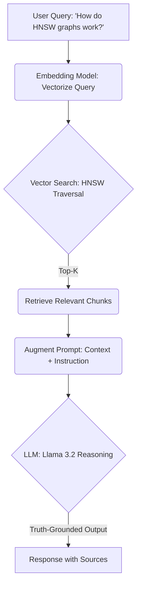

# 🏗️ End-to-End RAG Mechanics: An Architectural Deep Dive

This document provides a low-level technical decomposition of the Retrieval-Augmented Generation (RAG) lifecycle. It shifts from high-level abstractions to the underlying mathematical and structural principles that govern state-of-the-art RAG pipelines.

---

## 1. The Anatomy of Chunking: Contextual Cohesion
Parsing unstructured data into a model-readable format is the most critical pre-processing step. 

### Why Fixed-Length Splitting Fails
Naive splitting (breaking text every $N$ characters) inevitably severs semantic relationships. A sentence might be cut in half, or a subject might be separated from its predicate, leading to "Semantic Noise" during retrieval.

### RecursiveCharacterTextSplitter Logic
Instead of a fixed window, we utilize a hierarchical, recursive approach. The `RecursiveCharacterTextSplitter` attempts to split text using a list of separators in order of decreasing semantic importance:
1.  `"\n\n"` (Paragraphs)
2.  `"\n"` (Sentences/Lists)
3.  `" "` (Words)
4.  `""` (Characters)

The algorithm attempts to split by the first separator. If the resulting chunks are still larger than the `chunk_size`, it moves to the next separator in the hierarchy. This preserves the structural integrity of the text.

### The Mathematics of `chunk_overlap`
To mitigate the loss of context at the boundary of two chunks, we implement a sliding window via `chunk_overlap`. 
- **Contextual Cohesion:** By duplicating a percentage of the data across adjacent chunks, we ensure that if a query's answer spans across a split point, the semantic "signature" is present in at least one (or both) vectors.
- **Formula:** A common heuristic is an overlap of $10-20\%$ of the total `chunk_size`.

---

## 2. Embedding Dynamics: From Text to Hilbert Space
Embedding models like `nomic-embed-text` project discrete tokens into a high-dimensional continuous vector space, effectively creating a **Hilbert Space** where semantic similarity corresponds to geometric proximity.

### Semantic Distance
Once vectorized, text is no longer "words" but a coordinate in a space with hundreds or thousands of dimensions. We measure the "relatedness" of two vectors $A$ and $B$ using distance metrics:

#### Cosine Similarity
Measures the cosine of the angle between two vectors. It focuses on the **direction** rather than the magnitude, making it ideal for text where document length may vary.
$$ \text{similarity} = \cos(\theta) = \frac{\mathbf{A} \cdot \mathbf{B}}{\|\mathbf{A}\| \|\mathbf{B}\|} $$

#### Euclidean Distance ($L_2$)
Measures the straight-line distance between two points. This is sensitive to magnitude and is often used when the absolute values of the embedding dimensions carry specific weight.
$$ d(\mathbf{A}, \mathbf{B}) = \sqrt{\sum_{i=1}^{n} (a_i - b_i)^2} $$

---

## 3. The Vector Search Engine: Solving the Nearest Neighbor Problem
At scale (millions of chunks), computing the similarity between a query and every single document is computationally expensive ($O(n)$). 

### HNSW: Hierarchical Navigable Small Worlds
ChromaDB and similar engines utilize **HNSW**, an approximate nearest neighbor (ANN) algorithm.
- **The Graph Logic:** It builds a multi-layered graph where the top layers contain "long-range" links for fast traversal, and the bottom layers contain "short-range" links for high precision.
- **Efficiency:** It reduces search complexity to $O(\log n)$, allowing for sub-millisecond retrieval across massive datasets.

---

## 4. Advanced Retrieval Strategies
Basic Top-K retrieval often retrieves "adjacent" but irrelevant noise. Modern architectures utilize more nuanced strategies:

| Strategy | Description | Benefit |
| :--- | :--- | :--- |
| **Parent-Document Retrieval** | Extracts small chunks for high-precision search but returns the larger "parent" document for generation. | Provides the LLM with full context while keeping search fast. |
| **Contextual Compression** | Uses a secondary model to "compress" or filter the retrieved chunks down to only the relevant sentences. | Minimizes the "Generation Bottleneck" by removing noise. |

### The Precision vs. Recall Trade-off
- **Recall:** Retrieving *every* possible relevant chunk (leads to high $K$, higher costs, and noise).
- **Precision:** Retrieving *only* the most relevant chunks (leads to lower $K$, but risks missing the answer).

---

## 5. The Generation Bottleneck: "Lost in the Middle"
Empirical research shows that LLMs are better at utilizing information at the very beginning or end of a prompt. Context provided in the "middle" of a large retrieval set is often ignored or weighted poorly.

### Mitigation via Structured Templates
To prevent this, we use strict prompting templates that force the LLM to verify citations:
> "Based **strictly** on the context provided below, answer the user query. Reference the source. If the answer is not in the context, state that you do not have sufficient information."

---

## 6. End-to-End Flow: The Truth-Grounded Loop

### The "Truth-Grounded" Result
Unlike a standard LLM completion, the RAG output is **Non-Parametric Dependent**. The LLM acts as a linguistic interpreter for the factual data provided in the prompt, effectively acting as an "Auditor" rather than an "Author."

---
*Authored by Lead AI Architect Standards.*
