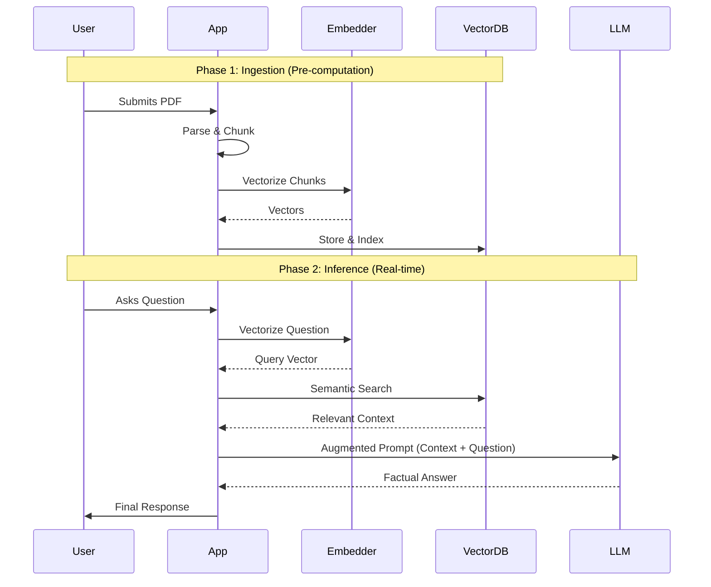

# 🤖 Modern RAG with LangChain & Ollama

A production-grade implementation of **Retrieval-Augmented Generation (RAG)** using the latest **LangChain (LCEL)**, **Ollama**, and **ChromaDB**.

## 🚀 Overview
This project demonstrates how to build a local, privacy-first RAG pipeline. By leveraging Ollama for LLMs and Embeddings, we ensure that your data stays on your machine while benefiting from the reasoning power of state-of-the-art open-source models like **Llama 3.1/3.2**.

---

## 🔄 The End-to-End RAG Workflow: A Deep Dive

RAG is not a single operation but a synchronized pipeline of modular steps. We categorize these into two distinct phases: **Knowledge Ingestion (Offline)** and **Inference (Online)**.

### Phase 1: Knowledge Ingestion (The Preparation)
Before any question is asked, the system must "understand" and index your data.

1.  **Document Loading & Parsing:**
    Raw files (PDF, Markdown, HTML) are extracted into plain text. At this stage, metadata (like page numbers or source URLs) is often preserved to allow for future source citations.
2.  **Semantic Chunking:**
    Long documents exceed the LLM's context window. We split text into smaller "chunks."
    - *Pro Logic:* We use **Recursive Character Splitting** with a `chunk_overlap`. This ensures that context at the borders of a chunk isn't lost, maintaining semantic continuity.
3.  **Vectorization (Embedding):**
    Each chunk is passed through an Embedding Model (e.g., `nomic-embed-text`). This model converts the text into a high-dimensional vector (a list of numbers) that represents the chunk's *meaning*.
4.  **Indexing & Vector Storage:**
    These vectors, along with their original text and metadata, are stored in a **Vector Database** (ChromaDB). The database builds an index (like HNSW) to allow for lightning-fast similarity searches later.

### Phase 2: Retrieval & Generation (The Runtime)
This happens in real-time when a user interacts with the system.

5.  **Query Transformation:**
    The user's natural language question is converted into the *exact same* vector space using the *same* embedding model used in Step 3.
6.  **Similarity Search (Retrieval):**
    The system compares the query vector against all chunk vectors in the database. Using mathematical distance metrics (like **Cosine Similarity**), it retrieves the "Top-K" most relevant snippets.
7.  **Prompt Augmentation:**
    The retrieved snippets (the Context) are combined with the user's original query into a structured template.
    - *Template:* `Answer the question based ONLY on the following context: [Retrieved Chunks]. Question: [User Query]`
8.  **Grounded Generation:**
    The augmented prompt is sent to the LLM (Llama 3.2). The LLM uses its "parametric" reasoning to synthesize the answer from the "non-parametric" context.
9.  **Post-Processing & Response:**
    The final answer is delivered to the user, ideally accompanied by citations pointing back to the specific source chunks.



---

## 🧠 Theory & Concepts

Building a high-performance RAG system requires understanding the delicate balance between information retrieval and linguistic generation.

### 🏛️ The RAG Philosophy: Parametric vs. Non-Parametric Knowledge
At its core, RAG acts as a bridge between two distinct types of AI "memory":
- **Parametric Knowledge (Internal):** This is the knowledge baked into the LLM during its training phase. It resides in the model's weights but is static, prone to hallucinations, and has a fixed cutoff date.
- **Non-Parametric Knowledge (External):** This is the dynamic information stored in your documents or databases. It is "unlimited" and up-to-date.

**The RAG Bridge:** RAG allows us to freeze the parametric knowledge and instead use the LLM as a "reasoning engine" that acts upon the non-parametric context provided at runtime.

### 📈 Evolution: Naive vs. Advanced RAG
The industry has moved beyond the "Naive RAG" stage into more sophisticated modular pipelines:
- **Naive RAG:** A simple linear process: *Question -> Vector Search -> Context + Question -> Answer*. It often fails when the search returns irrelevant data or when the LLM's context window is cluttered.
- **Advanced RAG (Modular):** Introduces pre-retrieval (query expansion), retrieval (hybrid search), and post-retrieval (re-ranking) steps. It treats RAG as a pipeline of distinct, optimizable modules rather than a single black box.

### 🔍 The Retrieval Spectrum: Sparse, Dense, and Hybrid
How we find information determines the quality of the answer:
- **Dense Retrieval (Semantic):** Uses vector embeddings (nomic-embed-text) to find "meaning." It excels at understanding synonyms and conceptual relationships but can miss specific keywords or technical codes.
- **Sparse Retrieval (Keyword):** Traditional match-based search (e.g., BM25). It is precise with specific terminology and unique identifiers but fails on semantic nuance.
- **Hybrid Search (The 2026 Standard):** Combines both methods. By merging semantic scores with keyword relevance, hybrid search ensures the retriever captures both the "vibes" and the "specifics."

### 🎯 Post-Retrieval Excellence: The Power of Re-ranking
Retrieving the top 10 chunks from a database doesn't mean they are all useful. **Re-ranking** involves taking those 10 chunks and running them through a second, more expensive model to determine their *true* relevance to the query. 
- It acts as a filter for **Context Poisoning**, ensuring the LLM isn't distracted by "noise" or irrelevant information that just happened to be near the right answer in the vector space.

### ⚖️ RAG vs. Fine-Tuning
A common misconception is that RAG and Fine-Tuning are interchangeable. In practice, they serve different masters:

| Feature | RAG | Fine-Tuning |
| :--- | :--- | :--- |
| **Primary Goal** | Knowledge Expansion (New Data) | Behavioral Alignment (Tone/Format) |
| **Data Update** | Near Instant (Update Vector DB) | Slow & Expensive (Retraining) |
| **Transparency** | High (Source Citations) | Low (Black Box) |
| **Hallucinations** | Significantly Reduced | Still Prevalent |
| **When to Use** | When you have dynamic factual data. | When you want a specific style or logic. |

### 📐 The RAG Triad: Evaluating Success
To move from a prototype to production, we measure three critical metrics:
1. **Context Precision:** Did the retriever find the right information? (Signal-to-noise ratio).
2. **Faithfulness (Groundedness):** Is the answer derived *only* from the retrieved context? (Anti-hallucination).
3. **Answer Relevancy:** Does the generator actually answer the user's core question?

---

## 🛠️ Tech Stack
- **Orchestration:** LangChain (using LCEL)
- **Model Provider:** Ollama (Llama 3.1 / 3.2)
- **Embeddings:** nomic-embed-text (via Ollama)
- **Vector Store:** ChromaDB (Local Persistence)
- **Language:** Python 3.10+

---

## 📁 Directory Structure
```text
├── data/               # Raw PDF/Text documents
├── notebooks/          # Exploration and experimentation
├── src/                # Core RAG logic
│   └── rag_pipeline.py # Main RAG class and LCEL chains
├── .vectorstore/       # Persistent ChromaDB storage
├── .env                # Environment variables
├── requirements.txt    # Project dependencies
└── README.md           # Documentation
```

---

## ⚙️ Setup & Installation

1. **Install Ollama:**
   Download and install from [ollama.com](https://ollama.com).
   
2. **Pull Required Models:**
   ```bash
   ollama pull llama3.1
   ollama pull nomic-embed-text
   ```

3. **Install Dependencies:**
   ```bash
   pip install -r requirements.txt
   ```

4. **Run the Pipeline:**
   Place your PDFs in the `data/` folder and update `src/rag_pipeline.py` to point to your files.

---

## ⚡ Key Features (Senior Engineering Approach)
- **LCEL Integration:** Uses `create_retrieval_chain` and `create_stuff_documents_chain` for modular, readable code.
- **Local Persistence:** ChromaDB stores embeddings locally in `.vectorstore/` for fast retrieval across sessions.
- **Semantic Splitting:** Uses `RecursiveCharacterTextSplitter` to maintain context across chunks.
- **Privacy First:** No data leaves your local environment.

---

> [!NOTE]
> This project is designed for extensibility. You can easily swap out `ChromaDB` for `FAISS` or `Pinecone`, or change the LLM to any other model supported by Ollama.

---
---

## 👨‍💻 About the Author
**Raghav Ramani**  
*AI/ML Developer & Deep Learning Practitioner*

I am an engineer focused on bridging the gap between theoretical Machine Learning and production-grade Generative AI. My approach is rooted in continuous skill-sharpening and a "never quit" mindset when tackling complex architectural challenges.

---

## 🛡️ Featured Project: ArthMitra
**ArthMitra** is not your typical "scam detection" model; it is a comprehensive **AI Financial Guardian**. It is designed to act as a real-time financial guide, integrating:

*   **Security & ML:** Real-time transaction anomaly detection (using Isolation Forests and Autoencoders) and NLP-driven scam analysis.
*   **Intelligent Planning:** Generative AI agents that provide inflation-proof goal planning and loan eligibility predictions.
*   **Advanced Orchestration:** A hybrid architecture utilizing LangGraph for supervisor routing and RAG for grounded financial literacy.

I am currently refining ArthMitra to handle complex, high-stakes financial data while continuing to push the boundaries of Deep Learning and local LLM performance.

---
*Developed by Senior AI Engineering Standards.*

